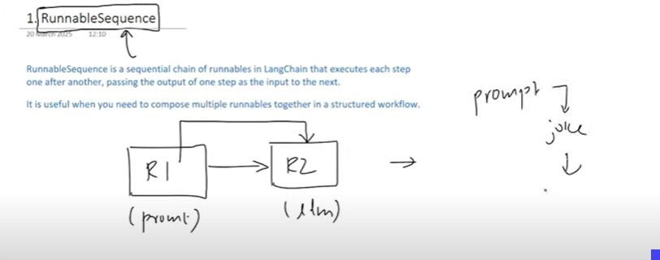
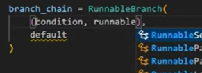

1.Runnable sequence:
Connects two runnables (for eg:Prompt, model) and executes them sequentially

2.Runnable parallel:Runs more than one models in parallels for output

3.Runnable Passthrough:Returns the same thing as output which was given as input

4.RunnableLambda:Allows u to convert any python function to custom runnables

5.RunnableBranch(if else of langchain):
