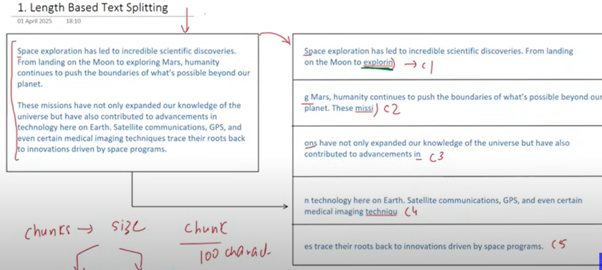
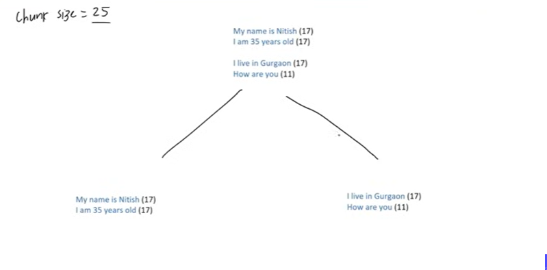
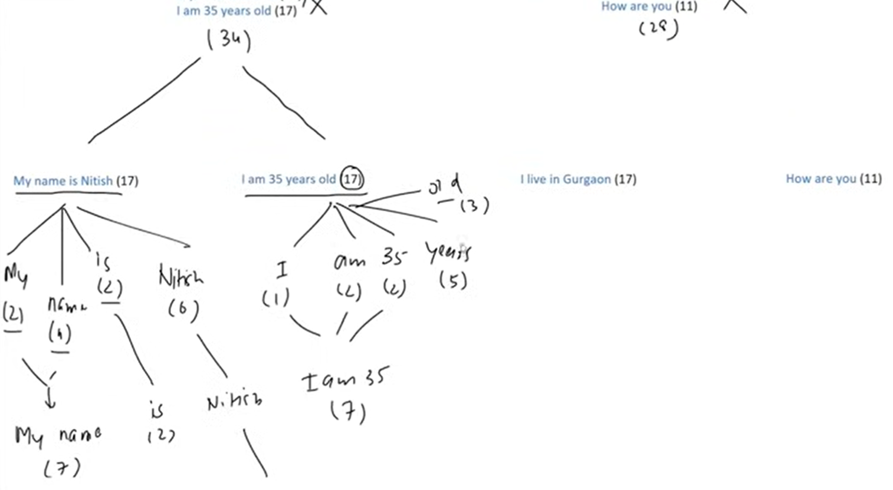

Types of Text splitters

1.Length based text splitters:

2.Text structure based structures:
#This is the most used text splitter in LangChain
This is the new chunk size,in old it was 10

3.Docoument Structure Based